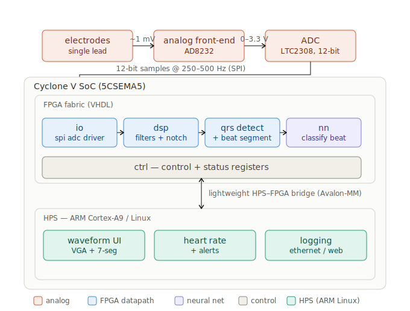

# FPGA-Based Electrocardiogram (EKG) Signal Processing System

**Author: Lucas Le**

**2026 Summer Project**
---

## Table of Contents

- [Demonstration Video](#demonstration-video)
- [Objective](#objective)
- [Introduction](#introduction)
- [High Level Design](#high-level-design)
  - [Background Math & Theory](#background-math--theory)
  - [Logical Structure](#logical-structure)
  - [Hardware/Software Tradeoffs](#hardwaresoftware-tradeoffs)
  - [Relationship to Standards](#relationship-to-standards)
- [Hardware Design](#hardware-design)
  - [Wiring & Connections](#wiring--connections)
  - [Board Photos](#board-photos)
- [FPGA Design](#fpga-design)
  - [ADC SPI Driver](#adc-spi-driver)
  - [DSP Pipeline](#dsp-pipeline)
  - [QRS Detection](#qrs-detection)
  - [JTAG Streamer](#jtag-streamer)
  - [Top-Level Integration](#top-level-integration)
- [Software Design (Python Visualizer)](#software-design-python-visualizer)
- [Results](#results)
  - [Signal Quality](#signal-quality)
  - [FPGA Resource Usage](#fpga-resource-usage)
  - [Timing & Latency](#timing--latency)
  - [BPM Accuracy](#bpm-accuracy)
- [Conclusion](#conclusion)
  - [Results vs. Expectations](#results-vs-expectations)
  - [Future Work](#future-work)
  - [Intellectual Property Considerations](#intellectual-property-considerations)
  - [Safety Considerations](#safety-considerations)
- [Work Distribution](#work-distribution)
- [Appendix](#appendix)
  - [Appendix A: Bill of Materials](#appendix-a-bill-of-materials)
  - [Appendix B: Hardware Schematic](#appendix-b-hardware-schematic)
  - [Appendix C: VHDL Source Listing](#appendix-c-vhdl-source-listing)
  - [Appendix D: Python Source Listing](#appendix-d-python-source-listing)
- [References](#references)

---

## Demonstration Video

<!--
╔══════════════════════════════════════════════════════════════════╗
║  ❌ PLACEHOLDER — FILL IN AT PROJECT END                       ║
║                                                                ║
║  Record a 2–3 minute demo video showing:                       ║
║    1. The full hardware setup (DE1-SoC + AD8232 + electrodes)  ║
║    2. The EKG signal appearing on the HEX displays             ║
║    3. The Python visualizer plotting real-time EKG data         ║
║    4. BPM detection working in real time                       ║
║  Upload to YouTube and embed the link below.                   ║
║                                                                ║
║  Example embed:                                                ║
║  [](   ║
║   https://www.youtube.com/watch?v=VIDEO_ID)                    ║
╚══════════════════════════════════════════════════════════════════╝
-->

---

## Objective

This project implements a real-time electrocardiogram (EKG) signal acquisition and processing system on an FPGA. Using a Terasic DE1-SoC (Cyclone V) board and a SparkFun AD8232 single-lead heart rate monitor, the system captures analog cardiac signals through the onboard LTC2308 12-bit SAR ADC, processes them through a digital signal processing (DSP) pipeline implemented entirely in VHDL, and streams the processed data to a PC-based Python visualizer for real-time waveform display and heart rate calculation.

---

## Introduction

Electrocardiogram (EKG/ECG) signals are among the most critical biomedical measurements, providing insight into cardiac rhythm, conduction abnormalities, and overall heart health. Commercial EKG systems rely on specialized mixed-signal ASICs for signal conditioning and DSP. This project explores an alternative approach: using an FPGA to perform the entire digital processing pipeline in hardware, offering deterministic timing, parallelism, and the flexibility to modify the processing chain without hardware changes.

The system is organized into three layers:

1. **Analog front-end:** The AD8232 single-lead heart rate monitor amplifies and filters the raw electrode signal, producing an analog output suitable for ADC digitization.
2. **FPGA digital back-end:** The Cyclone V FPGA drives the LTC2308 ADC via SPI at 360 samples/second, then routes the 12-bit samples through a configurable DSP pipeline (DC blocking, 50/60 Hz notch filter, bandpass FIR, QRS peak detection).
3. **PC visualization:** A Python application reads processed samples over the USB-Blaster JTAG interface and renders a real-time scrolling waveform with calculated BPM.

<!-- ❌ PLACEHOLDER: Add 1–2 more paragraphs here once the project is complete,
     discussing what aspects were most technically challenging, what the final
     result looks like in practice, and any interesting discoveries made
     during development. -->

---

## High Level Design

### System Block Diagram

The high-level architecture is shown in the diagram below:

<!-- ❌ PLACEHOLDER: Embed your system_architecture diagram here once finalized.
     If you create an updated version, replace the path below.

     
-->

> 📷 **IMAGE NEEDED:** `system_block_diagram` — A polished version of the system architecture diagram (draw.io, Visio, or similar). Should show AD8232 → LTC2308 ADC → FPGA pipeline → JTAG → PC with labeled signal paths and bus widths. Save to `diagrams/` and embed here.

```
┌──────────────┐    Analog    ┌──────────────┐     SPI      ┌──────────────────────────────────┐
│              │    Signal    │  LTC2308     │   12-bit     │          Cyclone V FPGA          │
│   AD8232     │─────────────►│  12-bit ADC  │─────────────►│                                  │
│  Heart Rate  │              │  (onboard)   │              │  ┌────────┐  ┌──────┐  ┌──────┐  │
│   Monitor    │              └──────────────┘              │  │  ADC   │─►│ DSP  │─►│ JTAG │  │
│              │                                            │  │ Driver │  │ Pipe │  │Stream│  │
└──────────────┘                                            │  └────────┘  └──────┘  └──┬───┘  │
   ▲ ▲ ▲                                                    │                           │      │
   │ │ │  Electrode pads (RA, LA, RL)                       └───────────────────────────┼──────┘
   │ │ │                                                                                │
   Patient                                                                              │ USB-Blaster
                                                                                        │ (JTAG UART)
                                                                                        ▼
                                                                                 ┌──────────────┐
                                                                                 │   Python      │
                                                                                 │  Visualizer   │
                                                                                 │  (PyQtGraph)  │
                                                                                 └──────────────┘
```

The VHDL module hierarchy within the FPGA:

| Module | Source File | Function |
|--------|------------|----------|
| `fpga_ekg_top` | `src/fpga_ekg_top.vhd` | Top-level entity, reset/IO routing |
| `sample_clock` | `src/sample_clock.vhd` | Generates 360 Hz sample tick from 50 MHz clock |
| `adc_spi_driver` | `src/adc_spi_driver.vhd` | SPI master for LTC2308 ADC |
| `dc_block` | `src/dc_block.vhd` | DC offset removal filter |
| `notch_5060` | `src/notch_5060.vhd` | 50/60 Hz powerline notch filter |
| `bandpass_fir` | `src/bandpass_fir.vhd` | Bandpass FIR filter (0.5–40 Hz) |
| `qrs_detect` | `src/qrs_detect.vhd` | QRS complex peak detector |
| `beat_segmenter` | `src/beat_segmenter.vhd` | Beat-to-beat segmentation |
| `nn_accel` | `src/nn_accel.vhd` | Neural network accelerator (classification) |
| `result_fifo` | `src/result_fifo.vhd` | Output FIFO buffer |
| `jtag_streamer` | `src/jtag_streamer.vhd` | JTAG UART data streamer to PC |
| `view_sig` | `src/view_sig.vhd` | Signal debug/view utility |

### Background Math & Theory

#### EKG Signal Characteristics

A standard single-lead EKG signal has the following characteristics:
- **Frequency range:** 0.5 Hz – 40 Hz (diagnostic bandwidth)
- **Amplitude:** ~1 mV at the skin surface, amplified to ~1–3 V by the AD8232
- **Key features:** P-wave, QRS complex, T-wave
- **Sampling rate:** 360 Hz (matching the standard AHA EKG database rate)

#### ADC Sampling

The LTC2308 is a 12-bit successive-approximation-register (SAR) ADC with an SPI interface. Key parameters:
- **Resolution:** 12 bits → 4096 levels
- **Input range:** 0 – 4.096 V (with internal reference)
- **Max throughput:** 500 ksps (we use 360 sps, well within margin)

At 360 Hz sampling rate, the Nyquist frequency is 180 Hz — comfortably above the 40 Hz upper EKG bandwidth.

> 📷 **IMAGE NEEDED:** `ekg_pqrst_labeled` — A labeled diagram of a single EKG heartbeat showing the P-wave, QRS complex, T-wave, PR interval, QT interval, and the ST segment. Can be hand-drawn or adapted from a textbook figure (with citation).

#### DSP Pipeline Theory

<!--
╔══════════════════════════════════════════════════════════════════╗
║  ❌ PLACEHOLDER — FILL IN AS YOU IMPLEMENT EACH FILTER         ║
║                                                                ║
║  For each DSP stage, document:                                 ║
║    • The transfer function H(z) or difference equation         ║
║    • Filter coefficients and how they were derived             ║
║    • Fixed-point representation used (Q-format, bit widths)    ║
║    • Frequency response plot (magnitude and phase)             ║
║    • Why this filter topology was chosen over alternatives     ║
║                                                                ║
║  Stages to cover:                                              ║
║    1. DC blocking filter (high-pass, ~0.5 Hz cutoff)           ║
║    2. 50/60 Hz notch filter (IIR notch or comb filter)         ║
║    3. Bandpass FIR (0.5–40 Hz, number of taps, window type)    ║
║    4. QRS detection algorithm (Pan-Tompkins or similar)        ║
╚══════════════════════════════════════════════════════════════════╝
-->

**1. DC Blocking Filter:**

<!-- ❌ PLACEHOLDER: Document the DC blocking filter design.
     Include: difference equation, cutoff frequency, implementation details. -->

> 📷 **IMAGE NEEDED:** `dc_block_freq_response` — Frequency response plot (magnitude & phase) of the DC blocking filter. Generate in MATLAB/Python with labeled axes.

**2. 50/60 Hz Notch Filter:**

<!-- ❌ PLACEHOLDER: Document the notch filter design.
     Include: transfer function, notch depth, Q-factor, IIR vs FIR choice. -->

> 📷 **IMAGE NEEDED:** `notch_freq_response` — Frequency response showing the notch at 50/60 Hz. Overlay the before/after spectrum if possible.

**3. Bandpass FIR Filter:**

<!-- ❌ PLACEHOLDER: Document the bandpass FIR filter design.
     Include: passband, stopband attenuation, number of taps, window function,
     coefficient table. -->

> 📷 **IMAGE NEEDED:** `bandpass_freq_response` — Frequency response of the bandpass FIR filter showing passband (0.5–40 Hz), transition bands, and stopband attenuation.

**4. QRS Detection:**

<!-- ❌ PLACEHOLDER: Document the QRS detection algorithm.
     Include: algorithm choice (Pan-Tompkins, etc.), threshold logic,
     refractory period handling, pseudocode or state machine diagram. -->

> 📷 **IMAGE NEEDED:** `qrs_state_machine` — State machine diagram for the QRS detection module. Can be a mermaid diagram or drawn in draw.io.

### Logical Structure

The FPGA design follows a synchronous pipeline architecture driven by a single 50 MHz clock domain. The data flow is:

1. The `sample_clock` module divides the 50 MHz system clock down to a 360 Hz tick.
2. Each tick triggers the `adc_spi_driver` to initiate an SPI transaction with the LTC2308.
3. The 12-bit result propagates through the DSP chain (`dc_block` → `notch_5060` → `bandpass_fir`).
4. The `qrs_detect` module identifies R-peaks for BPM calculation.
5. The `jtag_streamer` packages samples into the JTAG UART for PC transmission.

All modules use a common `clk` / `reset_n` interface with `valid` strobes for handshaking.

<!-- ❌ PLACEHOLDER: Once all modules are integrated, update this section with
     a detailed pipeline timing diagram showing the latency through each stage. -->

> 📷 **IMAGE NEEDED:** `pipeline_timing_diagram` — Timing diagram showing a single ADC sample propagating through each pipeline stage, with clock cycle counts and valid strobe alignment.

### Hardware/Software Tradeoffs

The decision to implement the DSP pipeline in VHDL rather than on the HPS (ARM Cortex-A9) was driven by:

- **Deterministic latency:** Hardware filters guarantee fixed sample-to-output delay with no OS jitter.
- **Parallelism:** Multiple filter stages can operate concurrently in the FPGA fabric.
- **Learning objective:** The project goal was to explore FPGA-based DSP, not to find the easiest solution.

The Python visualizer handles plotting and BPM display on the PC side because:
- PyQtGraph provides sophisticated real-time plotting that would be impractical on the FPGA alone.
- The JTAG UART provides a zero-additional-hardware data path to the PC.

<!-- ❌ PLACEHOLDER: Add any additional tradeoffs you encountered during development,
     e.g., fixed-point vs. floating-point, filter order vs. resource usage,
     JTAG bandwidth limitations. -->

### Relationship to Standards

- **AHA Database Standard:** The 360 Hz sampling rate was chosen to match the American Heart Association (AHA) EKG database standard, enabling future validation against standard test vectors.
- **IEC 60601-2-47:** While this project is not a medical device, the signal conditioning pipeline is designed with awareness of the IEC standard's recommended bandwidth (0.05–40 Hz for monitoring).
- **SPI (Serial Peripheral Interface):** The ADC communication follows standard SPI Mode 0 (CPOL=0, CPHA=0).

<!-- ❌ PLACEHOLDER: Add any additional standards relevant to your project,
     e.g., JTAG IEEE 1149.1, etc. -->

---

## Hardware Design

### Wiring & Connections

The AD8232 breakout board connects to the DE1-SoC via the onboard ADC input header and the GPIO_0 expansion header.

> 📷 **IMAGE NEEDED:** `wiring_photo_annotated` — Annotated close-up photo of the AD8232 breakout wired to the DE1-SoC GPIO header. Label each wire (OUTPUT, 3.3V, GND, LO+, LO−) with arrows or callouts.

> 📷 **IMAGE NEEDED:** `wiring_diagram` — A clean wiring/fritzing diagram showing the physical connections between the AD8232 breakout, electrode cable, and DE1-SoC headers. This is different from the schematic in Appendix B — this is a visual "how to plug it in" reference.

**Analog Signal (ADC Input):**

| AD8232 Pin | DE1-SoC Connection | Notes |
|---|---|---|
| **OUTPUT** | ADC CH0 input header | Analog EKG signal → LTC2308 Channel 0 |
| **3.3V** | 3.3V supply on GPIO_0 header | Power supply |
| **GND** | GND on GPIO_0 header | Common ground |

**Digital Signals (Leads-Off Detection via GPIO_0):**

| AD8232 Pin | FPGA Signal | GPIO_0 Pin | Quartus Pin | Purpose |
|---|---|---|---|---|
| **LO+** | `GPIO_0[0]` | JP1 Pin 1 | `PIN_AC18` | Leads-off detection (+) |
| **LO-** | `GPIO_0[1]` | JP1 Pin 2 | `PIN_Y17` | Leads-off detection (−) |
| — | `GPIO_0[2]` | JP1 Pin 3 | `PIN_AD17` | 3.3V Power / Output |

**Onboard ADC (LTC2308 SPI) — directly wired on DE1-SoC:**

| FPGA Signal | Quartus Pin | Direction | Purpose |
|---|---|---|---|
| `ADC_CONVST` | `PIN_AJ4` | Output | Conversion start pulse |
| `ADC_DIN` | `PIN_AK4` | Output | SPI config data to ADC |
| `ADC_DOUT` | `PIN_AK3` | Input | SPI result data from ADC |
| `ADC_SCLK` | `PIN_AK2` | Output | SPI clock |

**LED Indicators:**

| LED | Function |
|---|---|
| `LEDR[0]` | Heartbeat — blinks at 1 Hz to confirm clock and design are running |
| `LEDR[1]` | ADC busy — lit while a conversion is in progress |
| `LEDR[8]` | Sample valid — brief flash on each new ADC sample |
| `LEDR[9]` | Leads-off warning — lit if either electrode is disconnected |

### Board Photos

<!--
╔══════════════════════════════════════════════════════════════════╗
║  ❌ PLACEHOLDER — ADD PHOTOS THROUGHOUT DEVELOPMENT            ║
║                                                                ║
║  Include annotated photos of:                                  ║
║    1. Full hardware setup (DE1-SoC + AD8232 + electrodes)      ║
║    2. Close-up of AD8232 wiring to GPIO header                 ║
║    3. HEX displays showing live ADC values                     ║
║    4. LED indicators during operation                          ║
║                                                                ║
║  You already have these images — embed them here:              ║
║              ║
║                   ║
╚══════════════════════════════════════════════════════════════════╝
-->


> 📷 **IMAGE NEEDED:** `hex_display_adc_readout` — Photo of the DE1-SoC HEX displays showing a live 12-bit ADC value while the AD8232 is connected and reading a signal.

> 📷 **IMAGE NEEDED:** `full_setup_with_electrodes` — Photo of the complete end-to-end setup: DE1-SoC board with AD8232 wired, electrode pads attached to a person, USB cable to PC, Python visualizer visible on screen.

> 📷 **IMAGE NEEDED:** `led_indicators_running` — Photo showing the LED indicators during normal operation (LEDR[0] heartbeat, LEDR[8] sample valid flashing, LEDR[9] leads-off status).

---

## FPGA Design

### ADC SPI Driver

The `adc_spi_driver` module implements a bit-banged SPI master to communicate with the onboard LTC2308 12-bit SAR ADC. The driver is triggered by a `start` pulse from the sample clock and executes the following sequence:

1. Assert `ADC_CONVST` high for one clock cycle to begin conversion.
2. Clock out a 6-bit channel configuration word on `ADC_DIN` (selecting CH0 for the AD8232 output).
3. Simultaneously clock in 12 bits of conversion result on `ADC_DOUT`.
4. Assert `sample_valid` for one cycle when the result is ready.

The SPI clock is derived from the 50 MHz system clock.

<!-- ❌ PLACEHOLDER: Add an SPI timing diagram here showing the CONVST, SCLK,
     DIN, and DOUT waveforms for a single conversion cycle.
     You can capture this from your ModelSim/QuestaSim simulation. -->

> 📷 **IMAGE NEEDED:** `spi_timing_waveform` — ModelSim/QuestaSim waveform screenshot showing a single ADC conversion cycle: ADC_CONVST, ADC_SCLK, ADC_DIN, ADC_DOUT, sample_valid, and sample_data signals. Annotate the bit positions.

> 📷 **IMAGE NEEDED:** `adc_driver_state_machine` — State machine diagram for the `adc_spi_driver` FSM (IDLE → CONV → SHIFT → DONE or similar).

### DSP Pipeline

<!--
╔══════════════════════════════════════════════════════════════════╗
║  ❌ PLACEHOLDER — FILL IN AS EACH DSP MODULE IS COMPLETED      ║
║                                                                ║
║  For each module, describe:                                    ║
║    • Purpose and theory (reference the Background Math section)║
║    • VHDL implementation approach (direct-form, transposed,    ║
║      etc.)                                                     ║
║    • Fixed-point format and word widths                        ║
║    • Simulation waveform screenshots from ModelSim/QuestaSim   ║
║    • Any gotchas or bugs encountered                           ║
║                                                                ║
║  Modules:                                                      ║
║    • dc_block.vhd                                              ║
║    • notch_5060.vhd                                            ║
║    • bandpass_fir.vhd                                          ║
╚══════════════════════════════════════════════════════════════════╝
-->

> 📷 **IMAGE NEEDED:** `dc_block_sim_waveform` — ModelSim waveform showing dc_block input vs. output, demonstrating DC offset removal on a test signal.

> 📷 **IMAGE NEEDED:** `notch_sim_waveform` — ModelSim waveform showing notch_5060 removing a 60 Hz interference component from a test signal.

> 📷 **IMAGE NEEDED:** `bandpass_sim_waveform` — ModelSim waveform showing bandpass_fir input vs. output, with out-of-band noise visibly attenuated.

> 📷 **IMAGE NEEDED:** `dsp_pipeline_full_sim` — Full pipeline simulation: raw ADC input at the top, each filter stage output below it, showing progressive signal cleanup.

### QRS Detection

<!--
╔══════════════════════════════════════════════════════════════════╗
║  ❌ PLACEHOLDER — FILL IN WHEN QRS DETECTOR IS IMPLEMENTED     ║
║                                                                ║
║  Describe:                                                     ║
║    • The detection algorithm (Pan-Tompkins, threshold-based,   ║
║      etc.)                                                     ║
║    • State machine diagram                                     ║
║    • Threshold adaptation logic                                ║
║    • Refractory period handling                                ║
║    • How BPM is calculated from R-R intervals                  ║
║    • Simulation results showing detection on test waveforms    ║
╚══════════════════════════════════════════════════════════════════╝
-->

> 📷 **IMAGE NEEDED:** `qrs_detection_sim` — Simulation waveform showing the QRS detector correctly identifying R-peaks on a test EKG signal, with the detect pulse aligned to each QRS complex.

> 📷 **IMAGE NEEDED:** `rr_interval_bpm` — Annotated diagram or simulation showing how R-R intervals are measured and converted to BPM.

### JTAG Streamer

The `jtag_streamer` module uses the Altera JTAG UART megafunction to stream processed ADC samples to the PC over the existing USB-Blaster connection. This avoids the need for any additional UART hardware or cables.

Each 12-bit sample is sent as two ASCII hex characters followed by a newline, allowing the Python visualizer to parse incoming data with minimal overhead.

<!-- ❌ PLACEHOLDER: Describe the exact framing protocol, flow control
     (if any), and measured throughput. Include any issues with JTAG
     buffer overflows and how they were resolved. -->

> 📷 **IMAGE NEEDED:** `jtag_data_format` — Diagram showing the byte framing format sent over JTAG UART (e.g., header byte, sample MSB, sample LSB, newline — whatever your protocol is).

### Top-Level Integration

The top-level entity `fpga_ekg_top` instantiates all modules and routes signals between them:

- `KEY(0)` serves as an active-low asynchronous reset.
- `GPIO_0[0:1]` maps to the AD8232 leads-off detection pins.
- The three rightmost 7-segment displays (HEX0–HEX2) show the live 12-bit ADC value in hexadecimal.
- Upper displays (HEX3–HEX5) are blanked.
- Unused GPIO pins are driven to high-Z.

<!-- ❌ PLACEHOLDER: Once the full DSP pipeline is integrated into the
     top-level, update this section to describe the complete data path
     from ADC to JTAG output, including any MUX/bypass switches. -->

> 📷 **IMAGE NEEDED:** `rtl_viewer_top` — Screenshot from Quartus RTL Viewer showing the top-level schematic with all instantiated modules visible.

---

## Software Design (Python Visualizer)

The `ekg_visualizer.py` script provides a real-time graphical interface for monitoring the EKG signal streamed from the FPGA. It is built with:

- **PyQt6** — GUI framework
- **PyQtGraph** — high-performance real-time plotting
- **pyserial** — serial/JTAG communication

Key features:
- Scrolling waveform display with configurable time window
- Real-time BPM calculation and display
- Leads-off detection indicator

<!--
╔══════════════════════════════════════════════════════════════════╗
║  ❌ PLACEHOLDER — FILL IN WHEN VISUALIZER IS FINALIZED         ║
║                                                                ║
║  Add:                                                          ║
║    • A screenshot of the final visualizer UI                   ║
║    • Description of the data parsing / buffering strategy      ║
║    • How noise filtering is handled on the PC side (if any)    ║
║    • BPM calculation algorithm details                         ║
║    • Known issues and workarounds                              ║
╚══════════════════════════════════════════════════════════════════╝
-->


> 📷 **IMAGE NEEDED:** `visualizer_final_screenshot` — Screenshot of the **final** version of the Python EKG visualizer showing a clean EKG waveform with BPM readout, proper axis labels, and any status indicators.

> 📷 **IMAGE NEEDED:** `visualizer_leads_off` — Screenshot of the visualizer when electrodes are disconnected, showing the leads-off warning state.

---

## Results

<!--
╔══════════════════════════════════════════════════════════════════╗
║  ❌ PLACEHOLDER — FILL IN AT PROJECT END                       ║
║                                                                ║
║  This entire section should be written after you have final    ║
║  measurements. Include actual data, plots, and screenshots.    ║
╚══════════════════════════════════════════════════════════════════╝
-->

### Signal Quality

<!-- ❌ PLACEHOLDER: Include:
     • Raw ADC signal vs. filtered signal comparison plots
     • SNR measurement before and after DSP pipeline
     • Screenshot of clean EKG waveform with identifiable P-QRS-T features
     • Comparison against a known-good reference (e.g., AHA test vector) -->

> 📷 **IMAGE NEEDED:** `raw_vs_filtered_plot` — Side-by-side or overlaid plot comparing the raw ADC output vs. the DSP-filtered signal. Show the noise reduction clearly.

> 📷 **IMAGE NEEDED:** `clean_ekg_pqrst` — Screenshot of a clean EKG waveform from your system with P, QRS, and T features annotated/visible.

> 📷 **IMAGE NEEDED:** `snr_comparison_chart` — Bar chart or table graphic comparing SNR (dB) at each pipeline stage (raw → DC block → notch → bandpass).

### FPGA Resource Usage

<!-- ❌ PLACEHOLDER: Paste the Quartus compilation report summary.
     Include a table like:

     | Resource          | Used   | Available | % Used |
     |-------------------|--------|-----------|--------|
     | Logic Elements    | ???    | 32,070    | ???%   |
     | Registers         | ???    | ???       | ???%   |
     | Memory bits       | ???    | ???       | ???%   |
     | DSP blocks        | ???    | 87        | ???%   |
     | PLLs              | ???    | 6         | ???%   |
-->

> 📷 **IMAGE NEEDED:** `quartus_resource_summary` — Screenshot of the Quartus "Compilation Report → Fitter → Resource Usage Summary" panel.

> 📷 **IMAGE NEEDED:** `chip_planner_view` — (Optional) Screenshot from Quartus Chip Planner showing the physical placement of logic on the Cyclone V die.

### Timing & Latency

<!-- ❌ PLACEHOLDER: Include:
     • Fmax from Quartus Timing Analyzer
     • Sample-to-output latency (in clock cycles and microseconds)
     • JTAG streaming throughput (samples/sec actually achieved)
     • Any timing violations and how they were resolved -->

> 📷 **IMAGE NEEDED:** `timing_analyzer_fmax` — Screenshot from Quartus Timing Analyzer showing the Fmax (Slow 1100mV 85°C model).

### BPM Accuracy

<!-- ❌ PLACEHOLDER: Include:
     • Measured BPM vs. reference BPM (e.g., from a commercial pulse oximeter)
     • Accuracy over a range of heart rates (resting, active)
     • Failure cases (motion artifacts, electrode detachment) -->

> 📷 **IMAGE NEEDED:** `bpm_accuracy_table_or_chart` — Table or chart comparing your system's BPM reading against a reference device (pulse oximeter, smartwatch, etc.) across multiple trials.

> 📷 **IMAGE NEEDED:** `motion_artifact_example` — Screenshot showing what happens to the EKG signal and BPM reading during motion artifacts (e.g., moving arm while electrodes are attached).

---

## Conclusion

<!--
╔══════════════════════════════════════════════════════════════════╗
║  ❌ PLACEHOLDER — FILL IN AT PROJECT END                       ║
║                                                                ║
║  Write 2–3 paragraphs summarizing:                             ║
║    • What the project achieved overall                         ║
║    • What went well and what was difficult                     ║
║    • The most valuable lessons learned                         ║
╚══════════════════════════════════════════════════════════════════╝
-->

### Results vs. Expectations

<!-- ❌ PLACEHOLDER: Compare the final product against your original
     project plan (docs/FPGA_EKG_Project_Plan.docx).
     What did you accomplish that you planned? What didn't work out?
     What surprised you? -->

### Future Work

<!-- ❌ PLACEHOLDER: Describe 3–5 concrete extensions, for example:
     • Multi-lead EKG support (3-lead → 12-lead)
     • On-FPGA neural network for arrhythmia classification (nn_accel.vhd)
     • HPS (ARM) integration for Bluetooth/WiFi streaming
     • Beat segmentation and morphology analysis (beat_segmenter.vhd)
     • Power analysis and battery-operated portable design -->

### Intellectual Property Considerations

- The LTC2308 SPI driver was written from scratch based on the [LTC2308 datasheet](https://www.analog.com/en/products/ltc2308.html) and the DE1-SoC board schematic.
- The DSP filter designs are original implementations.
- The Python visualizer uses open-source libraries (PyQt6, PyQtGraph, pyserial) under their respective licenses.

<!-- ❌ PLACEHOLDER: Add any additional IP considerations — did you reference
     any existing code, tutorials, or open-source projects? List them here. -->

### Safety Considerations

> **⚠️ This project is NOT a medical device.** It is an educational prototype and must not be used for clinical diagnosis.

- The AD8232 provides built-in input protection and right-leg drive to minimize common-mode interference.
- Electrode connections are low-voltage (3.3V) and low-current, posing no shock hazard.
- The system is electrically isolated from mains power when running on USB power alone.

<!-- ❌ PLACEHOLDER: Add any additional safety notes relevant to your setup,
     e.g., laser safety (N/A here), RF emissions, etc. -->

---

## Work Distribution

<!--
╔══════════════════════════════════════════════════════════════════╗
║  ❌ PLACEHOLDER — FILL IN AT PROJECT END                       ║
║                                                                ║
║  If this is a solo project, you can replace this section with  ║
║  a brief timeline of your work. If it's a team project, list   ║
║  each member's contributions.                                  ║
║                                                                ║
║  Example for solo project:                                     ║
║                                                                ║
║  | Week | Focus Area                                    |      ║
║  |------|-----------------------------------------------|      ║
║  | 1    | Project scaffolding, toolchain, LED blinker   |      ║
║  | 2    | ADC SPI driver, Python visualizer v1          |      ║
║  | 3    | Testbench refinement, simulation automation   |      ║
║  | 4    | DSP filters, pipeline integration             |      ║
║  | ...  | ...                                           |      ║
╚══════════════════════════════════════════════════════════════════╝
-->

---

## Appendix

### Appendix A: Bill of Materials

| Qty | Component | Part Number | Source | Unit Cost | Total |
|-----|-----------|-------------|--------|-----------|-------|
| 1 | Terasic DE1-SoC (Rev F) | P0682 | Terasic | <!-- ❌ $ --> | <!-- ❌ $ --> |
| 1 | SparkFun AD8232 Heart Rate Monitor | SEN-12650 | SparkFun | <!-- ❌ $ --> | <!-- ❌ $ --> |
| 1 | Electrode Pad Set (3-lead) | — | <!-- ❌ --> | <!-- ❌ $ --> | <!-- ❌ $ --> |
| 1 | USB Cable (USB-Blaster) | — | Included with DE1-SoC | $0 | $0 |
| — | Jumper wires | — | — | — | — |
| | | | | **Total:** | **<!-- ❌ $ -->** |

### Appendix B: Hardware Schematic

<!--
╔══════════════════════════════════════════════════════════════════╗
║  ❌ PLACEHOLDER — ADD SCHEMATIC AT PROJECT END                 ║
║                                                                ║
║  Include a schematic showing:                                  ║
║    • AD8232 connections to the DE1-SoC                         ║
║    • Electrode pad connections                                 ║
║    • Power supply routing                                      ║
║                                                                ║
║  You can draw this in KiCad, Fritzing, draw.io, or even       ║
║  a clean hand-drawn diagram scanned to PDF.                    ║
╚══════════════════════════════════════════════════════════════════╝
-->

> 📷 **IMAGE NEEDED:** `hardware_schematic` — Full schematic (KiCad, Fritzing, or draw.io) showing AD8232 ↔ DE1-SoC connections, electrode interface, and power supply routing.

### Appendix C: VHDL Source Listing

The complete VHDL source files are available in the [`src/`](../src/) directory:

| File | Lines | Description |
|------|-------|-------------|
| [`fpga_ekg_top.vhd`](../src/fpga_ekg_top.vhd) | 231 | Top-level entity |
| [`adc_spi_driver.vhd`](../src/adc_spi_driver.vhd) | — | LTC2308 SPI master |
| [`sample_clock.vhd`](../src/sample_clock.vhd) | — | 360 Hz sample tick generator |
| [`dc_block.vhd`](../src/dc_block.vhd) | — | DC offset removal |
| [`notch_5060.vhd`](../src/notch_5060.vhd) | — | 50/60 Hz notch filter |
| [`bandpass_fir.vhd`](../src/bandpass_fir.vhd) | — | Bandpass FIR filter |
| [`qrs_detect.vhd`](../src/qrs_detect.vhd) | — | QRS peak detector |
| [`beat_segmenter.vhd`](../src/beat_segmenter.vhd) | — | Beat segmentation |
| [`nn_accel.vhd`](../src/nn_accel.vhd) | — | NN accelerator |
| [`result_fifo.vhd`](../src/result_fifo.vhd) | — | Output FIFO |
| [`jtag_streamer.vhd`](../src/jtag_streamer.vhd) | — | JTAG UART streamer |
| [`view_sig.vhd`](../src/view_sig.vhd) | — | Signal debug utility |

Testbenches are in the [`tb/`](../tb/) directory.

### Appendix D: Python Source Listing

| File | Description |
|------|-------------|
| [`ekg_visualizer.py`](../scripts/ekg_visualizer.py) | Real-time EKG waveform visualizer |
| [`simulate.do`](../scripts/simulate.do) | QuestaSim/ModelSim automation script |
| [`requirements.txt`](../scripts/requirements.txt) | Python dependencies |

---

## References

1. AD8232 Datasheet — Analog Devices. https://www.analog.com/en/products/ad8232.html
2. LTC2308 Datasheet — Analog Devices. https://www.analog.com/en/products/ltc2308.html
3. DE1-SoC User Manual — Terasic. https://www.terasic.com.tw/cgi-bin/page/archive.pl?No=836
4. Pan, J., & Tompkins, W. J. (1985). "A Real-Time QRS Detection Algorithm." *IEEE Trans. Biomedical Engineering*, BME-32(3), 230–236.

<!--
╔══════════════════════════════════════════════════════════════════╗
║  ❌ PLACEHOLDER — ADD MORE REFERENCES AS YOU USE THEM          ║
║                                                                ║
║  Include references for:                                       ║
║    • Any DSP textbooks or papers consulted                     ║
║    • FPGA design guides or application notes                   ║
║    • Open-source code or libraries used                        ║
║    • Online tutorials or forum posts that helped               ║
╚══════════════════════════════════════════════════════════════════╝
-->

---

## Master TODO Checklist

Use this checklist to track what's left to complete in this report. Items are grouped by **when** they can be done.

### ✍️ Can Write NOW (Incrementally)

- [ ] Fill in **Author**, **Course**, and **Date** at the top
- [ ] Expand the **Introduction** with 1–2 more paragraphs about challenges and discoveries
- [ ] Write the **DC Blocking Filter** theory section (difference equation, cutoff, design)
- [ ] Write the **50/60 Hz Notch Filter** theory section (transfer function, Q-factor)
- [ ] Write the **Bandpass FIR Filter** theory section (taps, window, coefficients)
- [ ] Write the **QRS Detection** algorithm section (Pan-Tompkins, state machine, thresholds)
- [ ] Expand **Hardware/Software Tradeoffs** with additional lessons learned
- [ ] Expand **Relationship to Standards** if applicable (JTAG IEEE 1149.1, etc.)
- [ ] Write the **DSP Pipeline** module descriptions as each filter is completed
- [ ] Document the **JTAG Streamer** framing protocol and flow control
- [ ] Fill in **BOM prices** in Appendix A
- [ ] Add **IP Considerations** for any referenced code/tutorials
- [ ] Add **References** as you consult new sources

### 📷 Images To Capture NOW (As You Work)

- [ ] `system_block_diagram` — Polished architecture diagram (draw.io/Visio)
- [ ] `ekg_pqrst_labeled` — Labeled P-QRS-T heartbeat diagram
- [ ] `wiring_photo_annotated` — Annotated close-up of AD8232 ↔ DE1-SoC wiring
- [ ] `wiring_diagram` — Fritzing/draw.io physical wiring guide
- [ ] `hex_display_adc_readout` — Photo of HEX displays showing live ADC value
- [ ] `led_indicators_running` — Photo of LEDs during normal operation
- [ ] `adc_driver_state_machine` — State machine diagram for adc_spi_driver FSM
- [ ] `spi_timing_waveform` — ModelSim screenshot of a single SPI conversion
- [ ] `dc_block_sim_waveform` — ModelSim waveform for DC block module
- [ ] `notch_sim_waveform` — ModelSim waveform for notch filter module
- [ ] `bandpass_sim_waveform` — ModelSim waveform for bandpass FIR module
- [ ] `dsp_pipeline_full_sim` — Full pipeline simulation (raw → each stage → output)
- [ ] `qrs_detection_sim` — QRS detector identifying R-peaks in simulation
- [ ] `rr_interval_bpm` — R-R interval measurement → BPM diagram
- [ ] `qrs_state_machine` — State machine diagram for QRS detection
- [ ] `jtag_data_format` — Byte framing format diagram
- [ ] `dc_block_freq_response` — Frequency response plot (MATLAB/Python)
- [ ] `notch_freq_response` — Notch filter frequency response plot
- [ ] `bandpass_freq_response` — Bandpass FIR frequency response plot

### 📷 Images To Capture LATER (Need More Progress)

- [ ] `full_setup_with_electrodes` — Complete end-to-end setup photo with electrodes on person
- [ ] `visualizer_final_screenshot` — Final Python visualizer with clean EKG + BPM
- [ ] `visualizer_leads_off` — Visualizer showing leads-off warning state
- [ ] `rtl_viewer_top` — Quartus RTL Viewer screenshot of top-level
- [ ] `pipeline_timing_diagram` — Timing diagram of sample through all stages

### 🏁 Fill In AT PROJECT END

- [ ] Record and embed the **Demonstration Video** (2–3 min, upload to YouTube)
- [ ] Write the **Results — Signal Quality** section with plots and SNR data
- [ ] Capture `raw_vs_filtered_plot` — Raw vs. filtered signal comparison
- [ ] Capture `clean_ekg_pqrst` — Clean EKG with annotated features
- [ ] Capture `snr_comparison_chart` — SNR at each pipeline stage
- [ ] Write the **FPGA Resource Usage** section and paste Quartus report
- [ ] Capture `quartus_resource_summary` — Resource usage screenshot
- [ ] Capture `chip_planner_view` — (Optional) Chip Planner placement view
- [ ] Write the **Timing & Latency** section with Fmax and latency measurements
- [ ] Capture `timing_analyzer_fmax` — Timing Analyzer Fmax screenshot
- [ ] Write the **BPM Accuracy** section with reference comparison data
- [ ] Capture `bpm_accuracy_table_or_chart` — BPM accuracy comparison
- [ ] Capture `motion_artifact_example` — Motion artifact screenshot
- [ ] Write the **Conclusion** (2–3 paragraphs)
- [ ] Write **Results vs. Expectations** (compare against project plan)
- [ ] Write **Future Work** (3–5 concrete extensions)
- [ ] Write the **Work Distribution** timeline table
- [ ] Add **Safety Considerations** notes if anything changed
- [ ] Create and embed `hardware_schematic` — Full schematic (Appendix B)
- [ ] Update **Top-Level Integration** section with final data path
- [ ] Final proofread and polish
