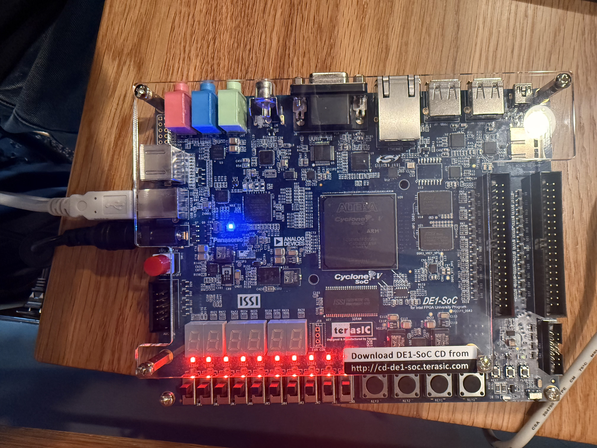

# Week 1 Progress Report: Project Scaffolding & Initial Setup

**Date:** June 19, 2026 - June 25, 2026

## Goals for the Week
- [x] Set up project repository and Git tracking
- [x] Create project directory structure (`/src`, `/tb`, `/quartus`, etc.)
- [x] Resolve nested submodule gitlink issues
- [x] Create base Quartus project and define full DE1-SoC pin assignments
- [x] Write top-level VHDL entity (`fpga_ekg_top.vhd`) and testbench
- [x] Validate toolchain by compiling and programming a 1Hz LED blinker
- [ ] Begin Phase 1: Implement SPI Driver for LTC2308 ADC

## Accomplishments
*What was actually completed this week? Provide details on the implementation.*
- Setup Git Repo and working directory
- Established the VHDL module hierarchy, writing stubs with interfaces for all pipeline stages (ADC driver, DSP filters, QRS detection, NN accelerator, and HPS FIFO).
- Compiled and programmed the board via JTAG
- Soldered and acquired the AD8232 Breakout Board.

## Challenges & Blockers
*What problems did you run into? How did you solve them?*
- **Challenge:** Quartus programmer only showed the `5CSEMA5F31` device and failed to program.
  - **Solution:** DE1-SoC has both an HPS and FPGA in the JTAG chain. Used "Auto Detect" to find the `SOCVHPS` device, then attached the `.sof` to the FPGA device.

## Next Week's Plan
*What are the immediate next steps?*
- Complete Phase 1: Write the `adc_spi_driver.vhd` to pull 12-bit samples from the AD8232 via the LTC2308 ADC.
- Verify the ADC driver using SignalTap or by routing the upper bits to the HEX displays.
- Begin Phase 2: Design and implement the 50/60Hz Notch Filter and Bandpass FIR.

## Media / Evidence
*Embed any screenshots, diagrams, or photos of the board working here.*

