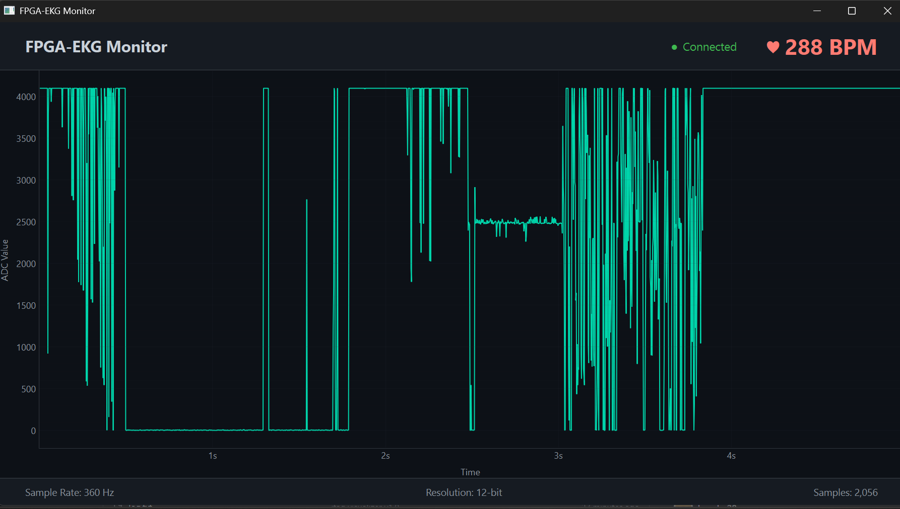
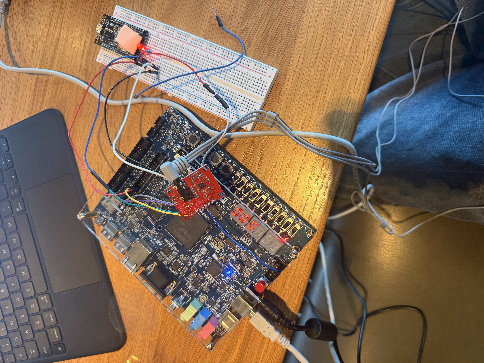

# Week 2 Progress Report: EKG Visualizer Implementation

**Date:** June 26, 2026 - July 03, 2026

## Goals for the Week
- Implement a Python-based EKG visualizer to read from the serial port.
- Visualize real-time data received from the FPGA.

## Accomplishments
- Built the initial Python EKG visualizer (`ekg_visualizer.py`) using PyQtGraph and PyQt6.
- Successfully established a serial connection with the FPGA/EKG module.
- Got real-time plotting of EKG signals and BPM calculation working.
- Ordered electrode stickers for further testing.

## Challenges & Blockers
- The visualizer is functional and does an "OK job", but there's still some stuff to iron out regarding data streaming stability and UI polish.
- The EKG signal is a bit noisy and the BPM calculation is not always accurate.
- Encountered several hardware integration issues, including problems with the JTAG port, managing the JTAG buffer, and dealing with faulty wiring.

## Next Week's Plan
- Continue refining the EKG visualizer and fix the remaining bugs.
- Finalize the system integration.

## Media / Evidence

